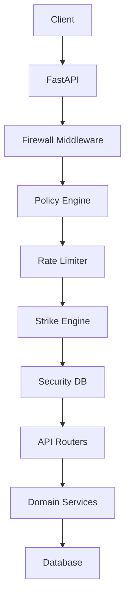

# Forkit Backend Architecture

## High-Level Flow

## Layers
- API Layer (FastAPI Routers)
- Security Layer (Firewall + Policies)
- Domain Layer (Ranking, Graph, Plans)
- Persistence Layer (Repositories + DB)
